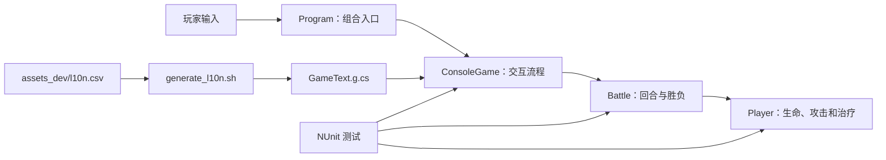

# BattleGame

BattleGame 是一个使用 C# 编写的双人回合制战斗模型，并提供“玩家对电脑”的控制台交互游戏。玩家每回合可以攻击或治疗，电脑固定执行攻击；任一角色生命值归零时战斗结束。

项目的重点不只是完成控制台玩法，还包括业务规则封装、分层设计、TDD、输入输出可测试性以及 macOS 双架构分发。

## 游戏规则

- 玩家和电脑初始生命值均为 100。
- 双方攻击力均为 20。
- 玩家先行动，每回合选择攻击或治疗。
- 攻击使目标损失 20 点生命。
- 治疗最多恢复 15 点生命，但不会超过最大生命值。
- 电脑回合固定攻击玩家。
- 无效输入会重新提示，不会消耗回合。
- 生命值降至 0 的角色死亡，另一方成为胜者。

当前没有治疗次数限制。由于电脑每回合造成 20 点伤害，而治疗最多恢复 15 点，玩家无法通过持续治疗让战斗永久停滞。

## 快速开始

开发环境需要 .NET 10 SDK：

```bash
dotnet run --project BattleGame.Cli/BattleGame.Cli.csproj
```

运行测试：

```bash
dotnet test BattleGame.sln
```

## 项目架构



### BattleGame.Core

核心领域层，目标框架为 `netstandard2.1`，不依赖控制台或测试框架，因此可以被不同类型的前端复用。

- `Player`：维护名称、最大生命值、当前生命值和攻击力，并实现受伤、治疗、攻击规则。
- `Battle`：维护当前行动者、当前防守者、胜者和回合切换。
- `BattleAction`：描述攻击和治疗动作，避免领域层依赖控制台中的字符串 `"1"`、`"2"`。

`Health` 使用私有 setter，外部不能直接修改生命值。`IsAlive` 由生命值实时推导，`IsFinished` 由 `Winner` 推导，从而避免同时保存多份可能不一致的状态。

### BattleGame.Cli

控制台表现层，目标框架为 `net10.0`。

- `Program`：只负责把 `Console.In` 和 `Console.Out` 传给游戏流程。
- `ConsoleGame`：读取名称和动作、控制电脑、显示生命值与胜者。
- `GameText.g.cs`：由 CSV 自动生成的中文词条，禁止手工修改。

`ConsoleGame` 接收 `TextReader` 和 `TextWriter`，没有直接把交互逻辑绑定到全局 `Console`。测试可以使用 `StringReader` 模拟整局输入，使用 `StringWriter` 检查完整输出。

### BattleGame.Tests

使用 NUnit 测试核心规则和端到端控制台流程，目标框架为 `net10.0`。

主要覆盖：

- 构造参数和非法状态校验。
- 普通伤害、致命伤害和生命值下限。
- 普通治疗、过量治疗、满血治疗和死亡后禁止治疗。
- 攻击者或目标死亡时禁止攻击。
- 攻击、治疗、回合交换、胜者记录和结束后禁止继续行动。
- 空名称、非法动作、玩家获胜和电脑获胜的完整控制台流程。

## 核心调用流程

玩家攻击时：

```text
ConsoleGame 读取“1”
    → Battle.ExecuteTurn(BattleAction.Attack, 15)
    → Player.Attack(target)
    → target.TakeDamage(AttackPower)
    → 判定胜者或交换回合
```

玩家治疗时：

```text
ConsoleGame 读取“2”
    → Battle.ExecuteTurn(BattleAction.Heal, 15)
    → Player.Heal(15)
    → 限制到 MaxHealth
    → 交换回合
```

只有合法输入才会调用 `Battle`，因此重新提示不会意外推进回合。

## 技术栈

| 范围 | 技术 | 用途 |
|---|---|---|
| 语言 | C# 9 / 最新 C# | Core 固定 C# 9，CLI 和测试使用 SDK 对应语言版本 |
| 运行时 | .NET 10 | 控制台应用、测试和发布 |
| 可复用核心 | .NET Standard 2.1 | 降低 Core 对具体宿主运行时的耦合 |
| 测试 | NUnit 4 | 单元测试和控制台流程测试 |
| 测试运行 | Microsoft.NET.Test.Sdk | 发现与执行测试 |
| 覆盖率 | coverlet.collector | 支持收集代码覆盖率 |
| macOS 发布 | `dotnet publish` | 生成 self-contained 单文件程序 |
| 签名与压缩 | `codesign`、`ditto` | 临时签名、ZIP 打包和权限保留 |

## TDD 工作方式

功能开发遵循 Red、Green、Refactor：

1. 先用测试描述玩家动作、状态变化和控制台可观察结果。
2. 运行测试，确认测试因缺少目标行为而失败。
3. 编写满足场景的最小实现。
4. 运行全部测试，再整理结构和注释。

打包脚本也有契约测试：

```bash
./script/package_macos_tests.sh
```

契约测试检查帮助接口、非法参数、严格 Shell 模式、测试前置、词条生成、签名验证和 SHA-256 生成。真正的跨架构发布由完整执行打包脚本进行端到端验证。

## 词条生成

控制台文案的唯一维护源是：

```text
assets_dev/l10n.csv
```

修改或新增文案后执行：

```bash
./script/generate_l10n.sh
```

脚本会更新 `BattleGame.Cli/GameText.g.cs`。不要直接修改生成文件，也不要在业务代码中硬编码新增控制台文案。

## macOS 打包

在 macOS 开发机上运行：

```bash
./script/package_macos.sh
```

脚本会自动完成：

1. 检查 .NET、Python、签名和压缩工具。
2. 生成最新词条代码。
3. 执行全部项目测试。
4. 顺序发布 `osx-arm64` 和 `osx-x64`，避免共享 MSBuild 中间目录的并发冲突。
5. 生成包含 .NET 运行时的 self-contained 单文件程序。
6. 加入双击启动脚本和中文使用说明。
7. 设置执行权限、清除扩展属性、执行临时签名并验证架构。
8. 对本机架构执行一局自动冒烟测试。
9. 生成两个 ZIP 和 SHA-256 校验文件。

输出文件：

```text
dist/BattleGame-macOS-arm64.zip
dist/BattleGame-macOS-x64.zip
dist/SHA256SUMS.txt
```

- M1、M2、M3、M4 等 Apple 芯片使用 `arm64`。
- Intel Mac 使用 `x64`。
- 最终玩家不需要安装 .NET。

脚本使用临时目录完成构建，成功后只替换 `dist` 中由它管理的固定名称，不会清空其他文件。

## macOS 签名限制

当前使用 `codesign --sign -` 进行临时签名，可以验证文件在打包过程中保持完整，但它不是 Apple Developer ID 签名，也没有经过 Apple 公证。

朋友首次打开时仍可能遇到 Gatekeeper 提示。确认压缩包来自可信来源后，可以在“系统设置 → 隐私与安全性”中选择“仍要打开”。如果需要面向公众分发，应申请 Developer ID、使用时间戳签名，并提交 Apple notarization。

## 目录结构

```text
BattleGame/
├── BattleGame.Core/          # 玩家与战斗领域规则
├── BattleGame.Cli/           # 控制台入口和交互流程
├── BattleGame.Tests/         # NUnit 测试
├── assets_dev/               # 中文词条 CSV
├── packaging/                # 分发说明和双击启动脚本
├── script/                   # 词条生成、打包及脚本测试
├── dist/                     # 打包产物
└── BattleGame.sln            # Visual Studio / dotnet 解决方案
```

`bin` 和 `obj` 是 .NET 构建产生的中间目录，不属于业务源码。

## 设计取舍与风险

- 当前电脑策略固定为攻击，便于验证规则，但没有策略选择或随机性。
- 玩家属性是固定配置，还没有角色职业、技能、装备或难度系统。
- `Player` 是公开的可变领域对象，外部代码理论上仍能绕过 `Battle` 直接调用攻击或受伤方法。扩展为复杂游戏时，可以考虑由战斗聚合统一拥有状态修改权限。
- self-contained 发布兼容性好，但每个压缩包包含完整运行时，因此文件体积明显大于依赖系统 .NET 的发布方式。
- 当前测试验证行为结果，但发布脚本没有连接 Apple 公证服务；公开分发前仍需要正式签名与公证流水线。

这些约束适合当前教学型、小规模控制台项目。若加入更多动作、状态效果或多个敌人，建议把回合动作建模为独立命令，并把电脑决策抽象成可替换策略。
