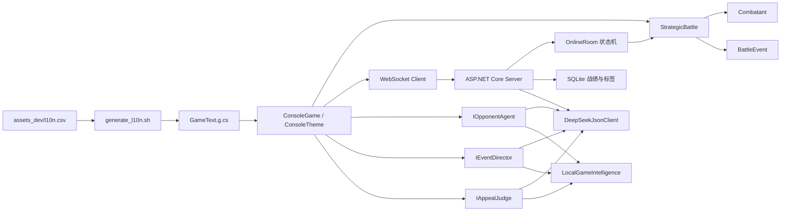

# BattleGame：AI 命运法庭

一个使用 C#、.NET 10、ASP.NET Core、SQLite 和 DeepSeek 构建的策略控制台游戏。既支持玩家与电脑单机对战，也支持两台 Mac 通过局域网房间码进行服务端权威的真人对战；客户端地址可以一键切换为公网 `wss://` 服务。

即使没有配置 DeepSeek，游戏也会自动使用本地策略、事件导演和规则裁判，保持完整可玩。

第一次游玩建议先阅读独立的 [完整玩法说明](docs/gameplay/README.md)。

## 快速开始

```bash
dotnet run --project BattleGame.Cli/BattleGame.Cli.csproj
```

启用 DeepSeek：

```bash
export DEEPSEEK_API_KEY="你的 API Key"
export DEEPSEEK_MODEL="deepseek-chat"   # 可选，可替换成账户当前可用模型
dotnet run --project BattleGame.Cli/BattleGame.Cli.csproj
```

API Key 只从环境变量读取，禁止写入源码、CSV、配置模板或 macOS 发布包。`.env` 已加入 `.gitignore`。

## 游戏规则

双方初始拥有 100 点生命、0 点能量，能量上限为 3。

| 动作 | 效果 | 策略关系 |
|---|---|---|
| 攻击 | 通常造成 20 伤害 | 对破防和治疗稳定施压 |
| 防御 | 把攻击伤害降为 5，成功时获得 1 能量 | 克制攻击，但害怕破防 |
| 破防 | 通常造成 10 伤害，对防御造成 30 | 克制防御，但收益不稳定 |
| 治疗 | 消耗 2 能量，最多恢复 25 生命 | 放弃伤害换取生存空间 |

双方动作先锁定，再同时结算。因此一方本轮受到致命伤害，也能完成已经锁定的动作；双方同时死亡时判定平局。电脑的决策任务在读取玩家本回合输入之前启动，不能偷看玩家选择。

## 难度与命运模式

电脑 Agent 返回动作排序，最终强度由 C# 代码控制，而不是只用提示词要求模型“变简单”：

| 难度 | 选择最优动作概率 |
|---|---:|
| 简单 | 40% |
| 中等 | 70% |
| 困难 | 90% |

事件偏向与电脑智力分开设置：

| 命运模式 | 事件有利于玩家的概率 |
|---|---:|
| 英雄 | 65% |
| 公平 | 50% |
| 残酷 | 35% |

每三回合触发一次事件，每局最多两次。当前受控事件包括恢复生命、损失生命和获得能量；随机事件伤害最低保留 1 点生命，不能直接决定胜负。

## 申诉机制

事件产生后暂不修改状态，先确定不利方：

```text
事件提案
  → 不利方是否还有申诉机会
  → 玩家输入理由 / 电脑 Agent 组织理由
  → 独立裁判 Agent 审理
  → 维持事件或撤销事件
  → C# 规则引擎执行最终结果
```

双方各有一次申诉机会，只有实际提交申诉才会消耗。用户理由最多 200 字，并被作为不可信数据包裹；模型返回的裁决必须解析成 `uphold` 或 `revoke`，其他输出会被拒绝并交给本地裁判。

## 项目架构



### BattleGame.Core

目标框架为 `netstandard2.1`，完全不知道控制台、HTTP 或 DeepSeek 的存在。

- `StrategicBattle`：动作合法性、同时结算、能量、胜负、事件应用和申诉次数。
- `Combatant`：受控生命与能量状态，setter 不向外部开放。
- `BattleEvent`：通过工厂方法限制事件类型和数值边界。
- `DifficultyPolicy`：用明确概率把动作排序转换成最终选择。
- 原有 `Player` / `Battle`：保留基础领域模型和历史测试，便于比较线性回合与战略回合设计。

### BattleGame.Cli

目标框架为 `net10.0`，承担应用编排和外部适配。

- `ConsoleGame`：启动配置、秘密选招、事件与申诉状态机。
- `ConsoleTheme`：ANSI 颜色、标题、分节、生命条和能量条。
- `DeepSeekJsonClient`：调用 `/chat/completions`，请求 JSON 输出。
- `DeepSeekOpponentAgent`：只负责电脑动作排序和电脑申诉。
- `DeepSeekEventDirector`：在事件白名单和数值范围内提出事件。
- `DeepSeekAppealJudge`：使用隔离提示词审理双方申诉。
- `LocalGameIntelligence`：断网、超时、非法 JSON 或无 Key 时的完整回退。
- `AiResponseParser`：把模型输出视为不可信输入，过滤动作并验证事件和裁决。
- `SpectreGameShell`：单机、局域网、公网和个人中心入口。
- `OnlineConsoleGame`：真人对战、限时答题、绝境任务、命运申诉和断线恢复。

### BattleGame.Online / Server / Persistence

- `OnlineRoom`：服务端权威回合、15 秒自动出招、题目、绝境任务和命运申诉状态机。
- `OnlineCommandProcessor`：WebSocket 命令校验、广播、DeepSeek 编排和本地降级。
- `SqlitePlayerProfileService`：设备身份哈希、战绩、标签与幂等赛果持久化。
- `BattleGame.Server`：默认监听 `0.0.0.0:5088`，同一程序可部署到公网并启用 TLS 反向代理。

更详细的信任边界与 JSON 协议见 [AI 架构文档](docs/AI_ARCHITECTURE.md)。联网双人、限时抢答、绝境裁决与标签系统的产品范围和开发排期见 [联网益智对战 PRD](docs/ONLINE_BATTLE_PRD.md)。

## DeepSeek 集成原则

DeepSeek 官方提供 Chat Completion、JSON Output 和 Tool Calls；本项目当前使用 Chat Completion 的 JSON 输出，并在本地进行二次验证：

- [Chat Completion](https://api-docs.deepseek.com/api/create-chat-completion)
- [JSON Output](https://api-docs.deepseek.com/guides/json_mode)
- [Tool Calls](https://api-docs.deepseek.com/guides/tool_calls)

模型不能直接调用 `Combatant` 修改状态，也不能返回任意数值。即使模型输出合法 JSON，仍必须满足领域白名单、当前能量、事件上限和裁决枚举。

外部请求超时为 20 秒。网络错误、超时、空响应、非法 JSON、非法动作、越界事件和未知裁决都会回退本地实现，不会让对局卡死。

## TDD 与测试

```bash
dotnet test BattleGame.sln
```

测试覆盖：

- 原有玩家受伤、治疗、攻击与线性回合规则。
- 同时攻击、攻防克制、破防惩罚、治疗能量约束和同时死亡。
- 随机事件不能直接杀死角色。
- 每方只有一次申诉。
- 三档难度由代码控制最优动作概率。
- 模型未知动作、重复动作和当前非法动作过滤。
- 越界事件与未知裁决拒绝。
- 控制台启动、事件展示、真人申诉、裁决撤销、无能量治疗重试和最终平局。

开发遵循 Red → Green → Refactor：先让新行为测试因缺少实现而失败，再写最小实现，最后运行全量回归。

## 词条与文案

所有控制台文案维护在：

```text
assets_dev/l10n.csv
```

修改后必须执行：

```bash
./script/generate_l10n.sh
```

不要直接编辑 `BattleGame.Cli/GameText.g.cs`，也不要在业务代码中硬编码新增界面文案。

## macOS 打包

```bash
./script/package_macos_tests.sh
./script/package_macos.sh
```

输出：

```text
dist/BattleGame-macOS-arm64.zip
dist/BattleGame-macOS-x64.zip
dist/SHA256SUMS.txt
```

两个版本均包含客户端和局域网服务器，也包含 .NET 运行时。朋友无需安装 .NET；联网 AI Key 只配置在运行服务器的 Mac 上，不会下发给玩家。

当前采用临时签名，不是 Apple Developer ID 签名，也未经过公证。公开分发前仍需要正式签名和 notarization。

## 目录结构

```text
BattleGame/
├── BattleGame.Core/          # 基础与战略领域规则
├── BattleGame.Cli/
│   ├── Ai/                   # DeepSeek、回退与输出验证
│   ├── ConsoleGame.cs        # 应用流程
│   └── ConsoleTheme.cs       # 控制台视觉
├── BattleGame.Tests/         # NUnit 测试
├── BattleGame.Online/        # 联网协议与权威房间状态机
├── BattleGame.Persistence/   # SQLite 玩家、战绩和标签
├── BattleGame.Server/        # WebSocket / HTTP 服务端
├── assets_dev/               # 文案 CSV
├── docs/                     # 玩法、AI 架构与联网版 PRD
├── packaging/                # macOS 启动脚本和使用说明
├── script/                   # 词条、测试和打包脚本
└── dist/                     # 被 Git 忽略的可分发产物
```

## 当前取舍与下一步

- 局域网身份使用本机随机设备令牌，服务端只保存哈希；正式商用账号可替换身份适配层。
- 房间状态当前在单进程内存中，SQLite 保存长期资料；水平扩容时需要 Redis/PostgreSQL。
- DeepSeek 只选择受控事件和审理申诉，异常时回退本地裁判，不能绕过规则引擎。
- 当前发布包为临时签名，公开商业分发仍需 Developer ID 签名、公证、TLS、隐私政策和真实双机灰度。
